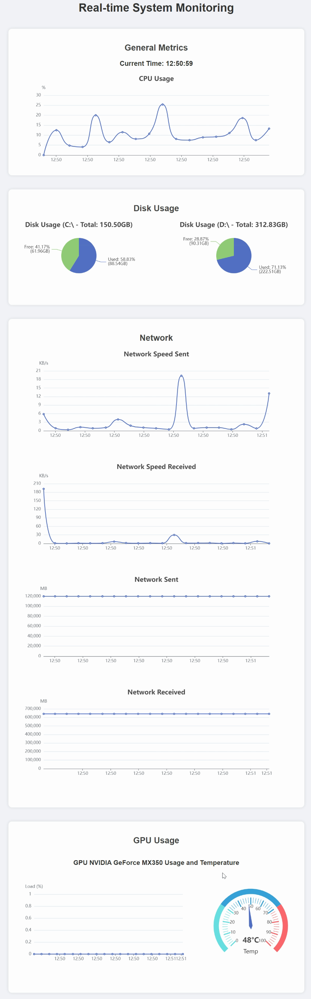

# WebSysMon

[](README_CN.md)
[](README.md)

WebSysMon 是一个通过网页界面实时监控系统状态的工具。它使用 HTML 和 ECharts 实现对 CPU、内存、磁盘、网络以及 GPU 的监控，并以图表形式直观展示。

### 功能特性
- 实时监控 CPU 使用率
- 实时监控内存使用率
- 实时监控磁盘使用情况
- 实时监控网络流量和速度
- 实时监控 GPU 使用率和温度

### 安装和使用

#### 先决条件
- Python 3.6+
- pip

#### 安装步骤

1. 克隆仓库:
    ```sh
    git clone https://github.com/guiyuanyuanbao/WebSysMon.git
    cd WebSysMon
    ```

2. 创建并激活虚拟环境（可选）:
    ```sh
    python -m venv venv
    source venv/bin/activate  # 对于 Windows，使用 `venv\Scripts\activate`
    ```

3. 安装依赖:
    ```sh
    pip install -r requirements.txt
    ```

4. 启动应用:
    ```sh
    python main.py
    ```

5. 打开浏览器并访问 `http://127.0.0.1:8000` 查看系统监控界面。

### 配置
默认情况下，WebSysMon 运行在端口 `8000`。你可以在 `main.py` 文件中修改端口设置。

### 使用
启动应用后，打开浏览器并访问 `http://127.0.0.1:8000`。系统监控信息将会以图表的形式实时显示在网页上。



### 许可证
本项目基于 Apache 许可证 2.0 进行分发。请参阅 [LICENSE](LICENSE) 文件获取更多信息。

### 贡献
欢迎提交问题 (issues) 和请求 (pull requests) 来改进本项目。如果你有任何建议或发现任何问题，请在 GitHub 上创建一个 issue。

---

英文文档请点击 [here](README.md)。
